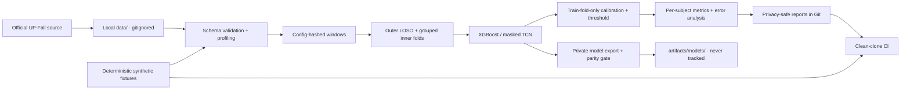

# FallSense architecture

## Trust boundaries

- 真實 participant data 只存在使用者機器的 gitignored `data/`，不進 Git history、CI 或 release。
- 所有 split 以 subject 為 group；scaling、imbalance handling、calibration 與 threshold selection
  都只能使用 outer-train subjects。
- `tests/fixtures/` 是固定 seed 產生的合成資料，只用來驗證軟體契約，不可替代研究評估。
- `reports/` 只保存可追溯的聚合結果與圖表；原始 windows、predictions 和 checkpoints 不公開。
- `artifacts/models/` 被 repository guard 明確禁止追蹤。沒有 derived-weight 授權前，不建立
  model-backed Docker image、Hugging Face Space 或公開 ONNX release。

## Evidence flow

每個正式實驗必須留下 config hash、split checksum、data-manifest checksum、Git commit、
per-subject metrics 與明確的 `RUN` / `QUICK-MODE-ONLY` 狀態。Headline 數字只能來自正式
registry 對應的結果，不能由 notebook cell、手動試跑或 pooled windows 取代。
